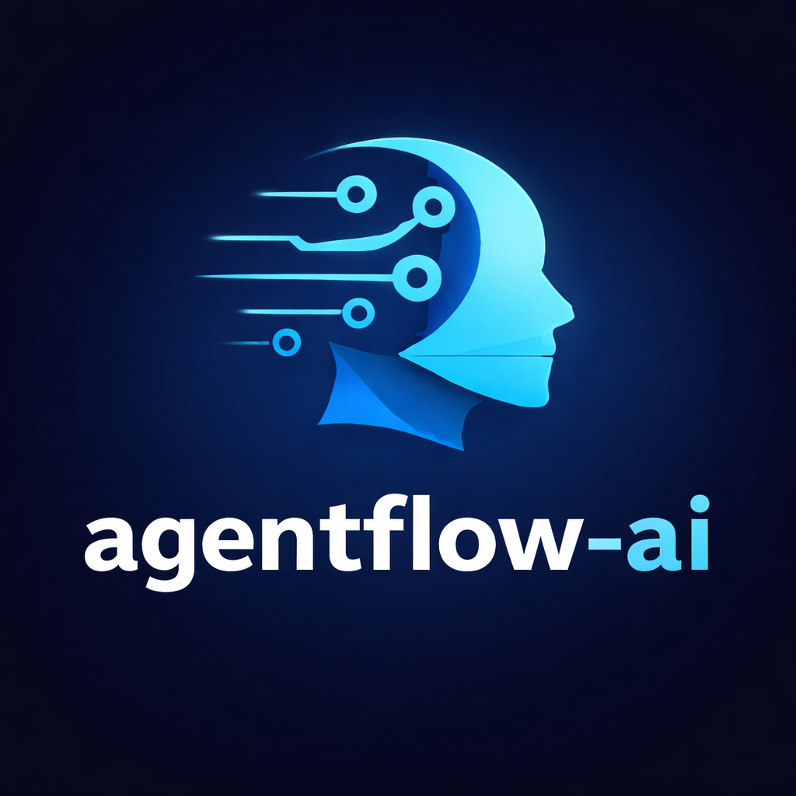

# AgentFlow

<p align="center">
  
</p>


[]()
[]()
[](https://opensource.org/licenses/MIT)
[]()

**The minimalist Python framework for building AI agents**

AgentFlow is a production-ready framework that makes building AI agents simple, testable, and extensible. Inspired by FastAPI's philosophy of developer experience first.

## 🚀 Key Features

- **🧪 Best-in-class Testing** - MockModel + AgentTestClient (FastAPI-inspired)
- **🔌 Native MCP Support** - First Python framework with MCP integration
- **⚡ Async-First** - Built on asyncio for maximum performance
- **🛡️ Production-Ready** - Robust loop with JSON auto-repair, timeout protection, loop detection
- **🔧 Tool Ecosystem** - Mix local Python tools with MCP servers seamlessly
- **📦 Multi-LLM** - Ollama, OpenAI, Mistral support out of the box
- **💾 Flexible Memory** - InMemory and FileMemory with custom backend support

## 📥 Installation

```bash
pip install agentflow-ai==1.0.0
```

## ⚡ Quick Start

### Basic Usage

```python
import asyncio
from agentflow import Agent

async def main():
    agent = Agent(model="llama3")
    response = await agent.arun("What is Python?")
    print(response)

asyncio.run(main())
```

### With Tools

```python
agent = Agent(model="gpt-4o")

@agent.tool
def multiply(a: int, b: int) -> int:
    """Multiply two numbers."""
    return a * b

response = await agent.arun("What is 123 * 456?")
```

### With MCP Servers

```python
from agentflow.mcp import MCPClient

# Connect to filesystem server
async with MCPClient(
    transport="stdio",
    command=["npx", "@modelcontextprotocol/server-filesystem", "/tmp"]
) as mcp:
    await agent.add_mcp_tools(mcp)
    response = await agent.arun("List files in /tmp")
```

## 🧪 Testing (Killer Feature)

```python
from agentflow.testing import MockModel, AgentTestClient

# Test without real LLM calls
model = MockModel(responses=["Hello! I'm an AI assistant."])
agent = Agent(model=model)
client = AgentTestClient(agent)

response = client.run("Hello")
client.assert_response_contains("Hello")
# client.assert_tool_called("my_tool")  # Use this when testing tools
```

## 🆚 Why AgentFlow?

| Feature | AgentFlow | LangChain | CrewAI | AutoGen |
|---------|-----------|-----------|---------|---------|
| **Easy Testing** | ✅ MockModel + TestClient | ❌ | ❌ | ❌ |
| **Native MCP** | ✅ First framework | ❌ | ❌ | ❌ |
| **Async-First** | ✅ | Partial | ❌ | ❌ |
| **Minimalist** | ✅ <700 LOC core | ❌ | ❌ | ❌ |
| **Production-Ready** | ✅ v1.0 | ✅ | Partial | Partial |

## 📚 Documentation & Examples

- **[Documentation](https://github.com/ia-nova-labs/agentflow-docs)** - Comprehensive guides and API reference
- **[Examples](https://github.com/ia-nova-labs/agentflow-examples)** - 8 complete examples covering all features

## 🏗️ Architecture

AgentFlow follows these principles:

- **Explicit > Magic** - Clear APIs, no hidden behavior
- **Minimal by default** - Start simple, add complexity when needed
- **Testable** - Built-in mocking and assertion helpers
- **Async-first** - Non-blocking I/O for performance

## 🔧 Requirements

- Python 3.9+
- httpx

## 📄 License

MIT License - see [LICENSE](LICENSE) file for details.

## 🙏 Credits

Created by Hamadi Chaabani

Inspired by:
- FastAPI's developer experience
- Anthropic's MCP vision
- The Python async ecosystem

## 🔗 Ecosystem

- **[agentflow](https://github.com/ia-nova-labs/agentflow)** - Main framework (this repo)
- **[agentflow-docs](https://github.com/ia-nova-labs/agentflow-docs)** - Documentation
- **[agentflow-examples](https://github.com/ia-nova-labs/agentflow-examples)** - Examples

## ⭐ Star History

If you find AgentFlow useful, please star it on GitHub!

---

**AgentFlow v1.0** - Production-ready. Fully tested. Simply powerful.
